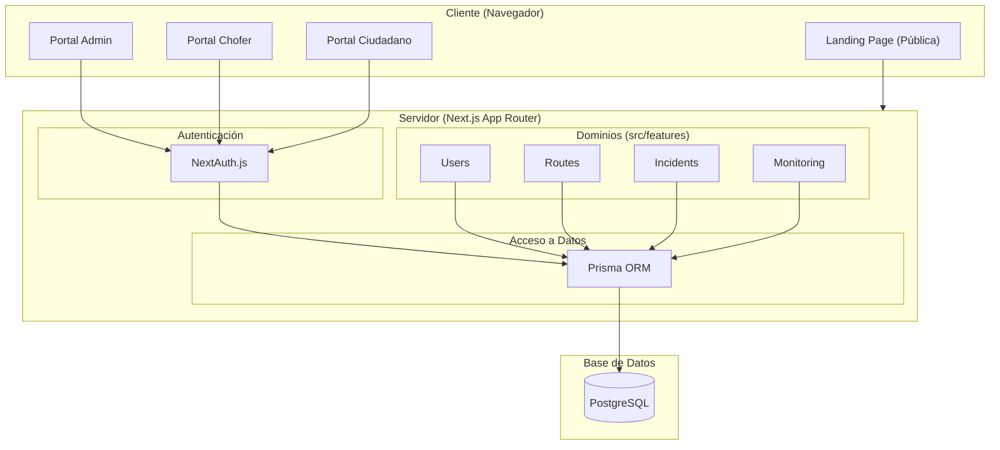

# 🏗️ Arquitectura Modular Basada en Características — SIRSS-GAU

Este documento describe la arquitectura oficial de **SIRSS-GAU** (Sistema Inteligente de Recolección de Residuos Sólidos Segregados para la Gestión Ambiental Urbana), una plataforma web inteligente diseñada para optimizar y modernizar la gestión de residuos sólidos en la ciudad del Cusco mediante tecnologías de **Smart City e IoT**.

---

## 1. Visión General del Sistema

**SIRSS-GAU** integra a ciudadanos, conductores de camiones recolectores y administradores municipales en una plataforma centralizada que permite el monitoreo en tiempo real, cálculo de rutas inteligentes, analítica urbana y gestión ambiental digital.

### 👥 Actores Principales del Sistema

1. **ADMIN (Administrador Municipal)**:
   - Gestiona cuentas de usuarios, perfiles de conductores, rutas de recolección, zonas urbanas, horarios de servicio, incidencias ambientales/operativas, alertas de emergencia, reportes gerenciales y analíticas operativas.
2. **DRIVER (Conductor de Compactador)**:
   - Visualiza su ruta asignada del día, registra su jornada de trabajo (asistencias y descansos), reporta incidencias de tránsito o bloqueo de vías, y comparte su ubicación GPS en tiempo real mediante integraciones móviles.
3. **CITIZEN (Ciudadano del Cusco)**:
   - Consulta calendarios y horarios de recolección, visualiza mapas interactivos con la ubicación en vivo del camión compactador, recibe notificaciones de alertas municipales y reporta incidencias de acumulación de residuos o contaminación de forma totalmente anónima.

---

## 2. Stack Tecnológico Principal

* **Framework**: Next.js App Router (Next 16+)
* **Lenguaje**: TypeScript
* **ORM**: Prisma ORM
* **Base de Datos**: PostgreSQL (levantada localmente mediante Docker)
* **Autenticación**: NextAuth.js (sesiones seguras y control de acceso basado en roles)
* **Estilos**: TailwindCSS v4
* **Manejo de Estado**: Zustand (únicamente para estados de interfaz de usuario)
* **Validación**: Zod

---

## 3. Principios de Arquitectura

### 3.1. Feature-Based Architecture (Arquitectura por Características)
Toda la lógica de negocio, pantallas y componentes específicos están autocontenidos dentro de dominios funcionales bajo `src/features/`. Esto previene el acoplamiento cruzado y permite escalar el sistema de forma limpia.

Cada dominio cuenta con la siguiente estructura interna estándar:
* `actions/`: Server Actions para mutaciones protegidas.
* `components/`: Componentes visuales específicos de este dominio.
* `schemas/`: Validaciones Zod para datos y formularios.
* `services/`: Lógica de negocio pesada e interactores externos.
* `types/`: Declaración de tipos e interfaces específicos.

### 3.2. Server-First & Server Actions
* **Lecturas**: Las consultas de base de datos se ejecutan directamente en los Next.js Server Components usando Prisma.
* **Mutaciones**: Los cambios de estado (creación, edición, eliminación) se gestionan mediante Server Actions optimizados, retornando respuestas estructuradas en el formato global `ActionResponse<T>`.

### 3.3. Estado en Zustand
Zustand se utiliza únicamente para manejar estados transitorios de la interfaz de usuario:
* Apertura y cierre de modales
* Filtros de búsqueda locales de las tablas
* Estados intermedios de los mapas GPS
* Toggles de vista móvil

---

## 4. Estructura Completa de Carpetas

A continuación se detalla la estructura física del proyecto **SIRSS-GAU**:

```
sirs-sgau/
├── .github/
│   └── instructions/                    # Reglas de codificación de IA y Copilot
│       ├── nextjs-prisma-generator/     # Reglas para validaciones Zod y Prisma
│       ├── nextjs-sgau-dashboard-generator/  # Patrones para diseño de dashboards
│       ├── nextjs-sgau-form-generator/       # Estándares para formularios dinámicos
│       ├── nextjs-sgau-table-generator/      # Reglas para tablas con ordenamiento y paginado
│       └── nextjs-sgau-map-generator/        # Pautas para mapas interactivos y GPS IoT
│
├── app/                                 # Enrutamiento de Next.js
│   ├── (dashboard)/                     # Área protegida del sistema (Actor-Portals)
│   │   ├── admin/                       # Portal del Administrador Municipal
│   │   │   ├── dashboard/               # Panel principal con KPIs
│   │   │   ├── users/                   # Gestión de usuarios del sistema
│   │   │   ├── drivers/                 # Gestión de choferes y asignaciones
│   │   │   ├── routes/                  # Diseño y asignación de rutas inteligentes
│   │   │   ├── zones/                   # Definición geográfica de zonas de Cusco
│   │   │   ├── schedules/               # Horarios de recolección
│   │   │   ├── incidents/               # Centro de resolución de incidencias
│   │   │   ├── reports/                 # Exportador de reportes en PDF/Excel
│   │   │   ├── alerts/                  # Emisión de alertas municipales
│   │   │   └── analytics/               # Analítica predictiva urbana
│   │   │
│   │   ├── driver/                      # Portal del Chofer del Compactador
│   │   │   ├── dashboard/               # Estado diario del chofer
│   │   │   ├── routes/                  # Navegador de ruta asignada
│   │   │   ├── gps/                     # Estado del transmisor GPS IoT
│   │   │   └── incidents/               # Reporte rápido de bloqueos o fallas
│   │   │
│   │   └── citizen/                     # Portal del Ciudadano
│   │       ├── dashboard/               # Buscador de horarios y reportes
│   │       ├── schedules/               # Cronograma vecinal de recolección
│   │       ├── monitoring/              # Monitoreo GPS en tiempo real del camión
│   │       └── incidents/               # Seguimiento de reportes ambientales
│   │
│   ├── (auth)/                          # Páginas de inicio de sesión y registro
│   │   ├── login/
│   │   ├── register/
│   │   ├── forgot-password/
│   │   └── logout/
│   │
│   ├── (public)/                        # Vistas públicas libres del sistema
│   │   ├── page.tsx                     # Landing Page oficial de SIRSS-GAU
│   │   ├── monitoring/
│   │   ├── routes/
│   │   ├── schedules/
│   │   ├── announcements/
│   │   ├── alerts/
│   │   └── about/
│   │
│   ├── api/                             # Integraciones y Webhooks externos
│   │   ├── auth/                        # Endpoints de autenticación (NextAuth.js)
│   │   ├── gps/                         # Receptor de coordenadas GPS IoT
│   │   └── webhooks/                    # Webhooks municipales o pasarelas
│   │
│   └── generated/                       # Modelos auto-generados por Prisma Client
│       └── prisma/
│           ├── internal/
│           └── models/
│
├── components/                          # Componentes globales de UI reutilizables
│   ├── charts/                          # Gráficos de analítica urbana
│   ├── forms/                           # Elementos e inputs de formularios
│   ├── layout/                          # Layouts y cabeceras del sistema
│   ├── maps/                            # Mapas y trazos geográficos (Leaflet/Mapbox)
│   ├── modals/                          # Diálogos modales
│   ├── sections/                        # Componentes de landing
│   ├── tables/                          # Tablas avanzadas con paginación
│   └── ui/                              # Primitivas visuales atómicas
│
├── config/                              # Configuraciones y variables de entorno globales
│
├── constants/                           # Enlaces de navegación y constantes del sistema
│
├── data/                                # Mockups y datos semilla estáticos
│
├── dev-tools/
│   └── sgau-db/                         # Docker Compose + PostgreSQL para desarrollo local
│
├── hooks/                               # React Hooks de uso transversal
│
├── lib/                                 # Servicios nucleares y singletons
│   ├── auth/                            # Configuración de Better Auth
│   ├── prisma/                          # Instancia compartida del cliente Prisma
│   ├── validations/                     # Validación de esquemas comunes
│   └── utils/
│       ├── helpers.ts                   # Validadores y utilidades de fecha
│       ├── formatters.ts                # Formateador de placas (ABC-123) y fechas (PE)
│       └── permissions.ts               # Control de accesos basado en roles (RBAC)
│
├── prisma/
│   ├── migrations/                      # Historial de migraciones SQL
│   ├── seeds/                           # Scripts de semillas para base de datos
│   └── schema.prisma                    # Esquema de base de datos relacional
│
├── public/                              # Recursos estáticos
│   ├── icons/
│   ├── illustrations/
│   ├── images/
│   ├── maps/
│   └── monitoring/
│
├── src/                                 # Lógica del núcleo de negocio
│   ├── features/                        # Features modulares y desacopladas
│   │   ├── auth/                        # Lógica de credenciales y seguridad
│   │   ├── users/                       # Administración de cuentas y roles
│   │   ├── drivers/                     # Gestión de conductores y turnos
│   │   ├── routes/                      # Planificación de trayectos inteligentes
│   │   ├── monitoring/                  # Central de monitoreo en tiempo real
│   │   ├── incidents/                   # Registro de incidencias y carga de fotos
│   │   ├── schedules/                   # Cronogramas y turnos de recolección
│   │   ├── zones/                       # Mapeo y dibujo de distritos
│   │   ├── announcements/               # Avisos y noticias a los ciudadanos
│   │   ├── alerts/                      # Gestión de notificaciones urgentes
│   │   ├── reports/                     # Motor de reportes operativos
│   │   ├── analytics/                   # Analíticas avanzadas de recolección
│   │   └── dashboard/                   # Disposición espacial del panel
│   │
│   └── hooks/                           # Hooks de dominio específico
│
├── styles/
│   ├── globals.css                      # Estilos CSS de TailwindCSS v4
│   └── themes/                          # Temas de personalización municipal
│
└── types/                               # Definiciones de tipo globales de TypeScript
    ├── action-response.ts               # Formato unificado de Server Actions
    ├── api-response.ts                  # Formato unificado de endpoints API
    ├── auth.ts                          # Tipos de sesión, usuario y roles del sistema
    └── dashboard.ts                     # Estructura de widgets y KPIs
```

---

## 5. Decisiones de Diseño Clave

### 5.1. Formatos de Respuesta Unificados
Para mantener una comunicación de datos consistente entre cliente y servidor, el sistema implementa:
* **Server Actions**: Devuelven exclusivamente `ActionResponse<T>` en [types/action-response.ts](file:///c:/Users/USER/Desktop/SIRSS-GAU/sirs-sgau/types/action-response.ts).
* **API Handlers / Webhooks**: Devuelven exclusivamente `ApiResponse<T>` en [types/api-response.ts](file:///c:/Users/USER/Desktop/SIRSS-GAU/sirs-sgau/types/api-response.ts).

### 5.2. Geotargeting y Localización
* Las fechas y horas en la base de datos se formatean localmente para el huso horario de Perú (`America/Lima`).
* Las placas vehiculares de los camiones compactadores siguen un regex y formateador nacional (`ABC-123`) implementados en [lib/utils/formatters.ts](file:///c:/Users/USER/Desktop/SIRSS-GAU/sirs-sgau/lib/utils/formatters.ts).

### 5.3. Seguridad y Autorización (RBAC)
* La lógica de permisos de los tres roles principales del sistema está centralizada en [lib/utils/permissions.ts](file:///c:/Users/USER/Desktop/SIRSS-GAU/sirs-sgau/lib/utils/permissions.ts).
* El acceso al panel administrativo (`/admin`), portal del chofer (`/driver`) y portal ciudadano (`/citizen`) está custodiado por sesiones de **NextAuth.js** e interactores de permisos en la raíz de enrutamiento.

---

## 6. Diagrama de Arquitectura

A continuación se presenta un diagrama de alto nivel de la arquitectura del sistema:


